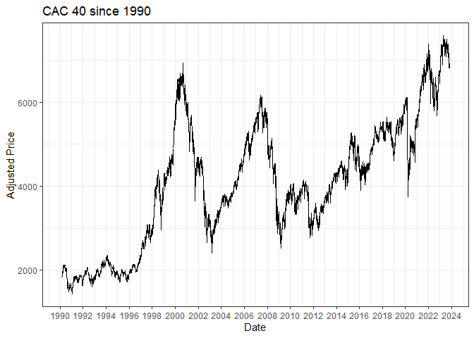
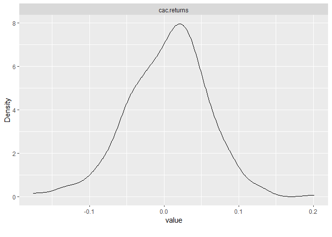
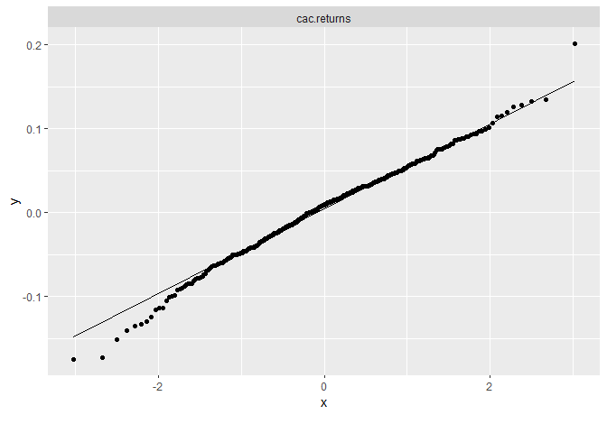

Equity portfolio construction and efficient diversification with
emerging risks as climate risks and inflation
================
Pierre Clauss
November 2023

## Foreword

To begin this project, I have to precise the 3 necessary steps for a
data science project:

1.  data: (i) importation, (ii) wrangling and (iii) visualisation (or
    named also *exploratory data analysis*)
2.  modelling
3.  results communication

To achieve these 3 steps, the universe of the package **tidyverse** is
essential for R nowadays.

``` r
library(tidyverse)
```

The first step on data seems often a thankless task but it takes time
(we can estimate it to more than 50% of a data science project) and it
is essential for the success of the project.

The second step is the most grateful for a data scientist. But it is
important to know that the first step and the second one are overlapped:
indeed, when I wrangle or I visualise my data, I often have an idea of
the models I will try.

Finally, the third step is often neglected to a simple ppt, word or tex
document. But it has to be more appreciated with the new tools and this
example of R Markdown document and github website is an attempt to show
you how to communicate better the results of a data science project.

Here, I will focus on the data step to begin well the project.

## 1 Data importation

I import the data with the package **tidyquant**.

``` r
library(tidyquant)

# import data
(cac <- tq_get(
  "^FCHI",
  from = '1990-03-01',
  to = "2023-10-30",
  get = "stock.prices"
))
```

    ## # A tibble: 8,694 × 8
    ##    symbol date        open  high   low close volume adjusted
    ##    <chr>  <date>     <dbl> <dbl> <dbl> <dbl>  <dbl>    <dbl>
    ##  1 ^FCHI  1990-03-01  1836  1838  1827  1832      0     1832
    ##  2 ^FCHI  1990-03-02  1831  1860  1831  1860      0     1860
    ##  3 ^FCHI  1990-03-05  1866  1874  1862  1874      0     1874
    ##  4 ^FCHI  1990-03-06  1869  1875  1866  1872      0     1872
    ##  5 ^FCHI  1990-03-07  1874  1881  1874  1880      0     1880
    ##  6 ^FCHI  1990-03-08  1891  1923  1891  1917      0     1917
    ##  7 ^FCHI  1990-03-09  1936  1941  1921  1921      0     1921
    ##  8 ^FCHI  1990-03-12  1917  1918  1912  1912      0     1912
    ##  9 ^FCHI  1990-03-13  1924  1924  1924  1924      0     1924
    ## 10 ^FCHI  1990-03-14  1919  1946  1919  1946      0     1946
    ## # ℹ 8,684 more rows

``` r
tail(cac)
```

    ## # A tibble: 6 × 8
    ##   symbol date        open  high   low close   volume adjusted
    ##   <chr>  <date>     <dbl> <dbl> <dbl> <dbl>    <dbl>    <dbl>
    ## 1 ^FCHI  2023-10-20 6850. 6881. 6816. 6816.        0    6816.
    ## 2 ^FCHI  2023-10-23 6820. 6856. 6774. 6850. 53038700    6850.
    ## 3 ^FCHI  2023-10-24 6865. 6909. 6834. 6894. 58807000    6894.
    ## 4 ^FCHI  2023-10-25 6860. 6927. 6847. 6915. 69113800    6915.
    ## 5 ^FCHI  2023-10-26 6836. 6915. 6826. 6889. 71582200    6889.
    ## 6 ^FCHI  2023-10-27 6899. 6899. 6785. 6795. 68755200    6795.

``` r
# plot
cac %>%
  ggplot(aes(x = date, y = adjusted)) +
  geom_line() +
  ggtitle("CAC 40 since 1990") +
  scale_x_date(date_breaks = "2 years", date_labels = "%Y") +
  labs(x = "Date", y = "Adjusted Price") +
  theme_bw()
```

<!-- -->

## 2 Data wrangling

The wrangling (*démêlage* in French) consists in the storage and the
transformation of the data. “Tidying and transforming are called
**wrangling**, because getting your data in a form that’s natural to
work with often feels like a fight” [R for Data
Science](https://r4ds.had.co.nz/introduction.html) (Grolemund G. and
Wickham H.).

I could need for the project monthly returns to model on for instance.

``` r
# transmute
cac_monthly_returns <- cac %>%
  tq_transmute(
    select     = adjusted,
    mutate_fun = periodReturn,
    period     = "monthly",
    col_rename = "cac.returns"
  )
tail(cac_monthly_returns)
```

    ## # A tibble: 6 × 2
    ##   date       cac.returns
    ##   <date>           <dbl>
    ## 1 2023-05-31     -0.0524
    ## 2 2023-06-30      0.0425
    ## 3 2023-07-31      0.0132
    ## 4 2023-08-31     -0.0242
    ## 5 2023-09-29     -0.0248
    ## 6 2023-10-27     -0.0476

We can see below, thanks to the package **DataExplorer**, a summary of
the tidy data observed for the variable.

``` r
library(DataExplorer)
plot_intro(cac_monthly_returns)
```

<!-- -->

I can conclude that data are tidy without missing values.

## 3 Data visualisation

Data viz has to be thought in relation with modelling. Then, I am
interested by visualising the distribution of the returns.

Some statistics to sum up the distribution can be shown below: I can
observe symmetric data with a median and a mean which are quite equal.

``` r
summary(cac_monthly_returns)
```

    ##       date             cac.returns       
    ##  Min.   :1990-03-30   Min.   :-0.174903  
    ##  1st Qu.:1998-08-23   1st Qu.:-0.029160  
    ##  Median :2007-01-14   Median : 0.009383  
    ##  Mean   :2007-01-14   Mean   : 0.004687  
    ##  3rd Qu.:2015-06-06   3rd Qu.: 0.038840  
    ##  Max.   :2023-10-27   Max.   : 0.201189

I can go deeper thanks to distribution graphics: the non-parametric
(kernel method) estimation of the distribution and QQ-plots.

``` r
plot_density(cac_monthly_returns)
```

<!-- -->

``` r
plot_qq(cac_monthly_returns)
```

<!-- -->

You are ready now to use data!
